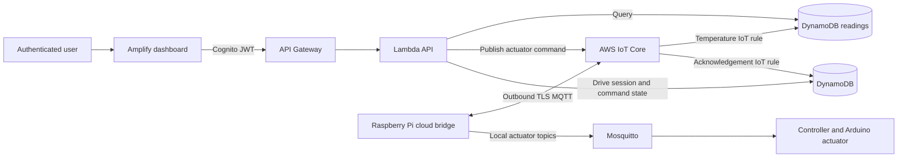

# Amplify Dashboard Design

## Goal

Make the MobileFrost dashboard accessible through AWS Amplify for authenticated
users. Users can review cloud temperature history, start and stop a recorded
drive session, and set the cooling fan and flap. The Raspberry Pi remains
operational without internet access and does not expose an inbound port to the
public internet.

## Current State

The local dashboard is a Flask application running on the Raspberry Pi and is
bound to loopback by Compose. It reads PostgreSQL and has local control
endpoints. The optional `cloud_sync` process publishes temperature events to
AWS IoT Core, but does not subscribe to cloud commands. The local controller
accepts fan and flap commands from Mosquitto and has no drive-session lifecycle.
Automatic cooling can overwrite manual actuator settings on a later sensor
update. Terraform defines the cloud resources, but they have not been applied.

The current Flask control endpoints are not authenticated and must not be
exposed directly through Amplify, a public tunnel, or an internet-facing proxy.

## Recommended Architecture

Amplify Hosting serves a static dashboard frontend. The frontend authenticates
users through an Amazon Cognito User Pool and sends requests to an API Gateway
HTTP API. A JWT authorizer protects every application API route. Lambda
functions query a DynamoDB readings table for temperature history and latest readings,
manage drive-session records, validate actuator values, and publish actuator
commands to AWS IoT Core. The browser never receives AWS device-certificate
credentials and does not connect directly to the MQTT broker.

The Raspberry Pi initiates an outbound TLS MQTT connection to AWS IoT Core using
its device certificate. A cloud bridge subscribes only to its assigned command
topics, forwards fan and flap commands to the existing local Mosquitto actuator
topics, and publishes command acknowledgements to AWS IoT Core. An IoT rule
writes temperature events to a DynamoDB readings table and another routes
command acknowledgements to a DynamoDB operations table. The bridge can run as an
opt-in Compose service independently of the local controller.

## User-Facing Behavior

- Sign-in is required before loading readings or changing system state.
- The dashboard shows latest cloud readings and the existing 1-hour, 24-hour,
  and 7-day history ranges.
- Starting a drive creates one active session with a server-generated ID and
  UTC start timestamp. Stopping it closes that session with a UTC end timestamp.
  Drive controls record an operational session only; they do not start a motor
  or assert that GPS or distance telemetry is available.
- Fan values are integers from 0 through 255. Flap values are integers from 0
  through 90 degrees. The API validates values even if the browser UI is
  bypassed.
- An actuator request is shown as pending until the Pi bridge acknowledges it;
  failures and timeouts are shown as unconfirmed rather than reported as
  successful hardware changes.
- The interface explains that automatic temperature control may override manual
  fan or flap settings on a later sensor update, matching current controller
  behavior.
- When the internet or AWS is unavailable, local sensing, PostgreSQL storage,
  automatic cooling, and the local dashboard continue. Cloud commands cannot
  be issued or confirmed while disconnected.

## API and Data Contracts

The authenticated API provides:

- `GET /api/temperatures?hours=1|24|168`: latest readings and time series from
  DynamoDB.
- `GET /api/drive`: current active session, if any.
- `POST /api/drive/start` and `POST /api/drive/stop`: idempotent session
  lifecycle operations recorded in DynamoDB.
- `POST /api/actuators/fan` and `POST /api/actuators/flap`: validated,
  correlated command requests. Responses indicate accepted/pending, not physical
  completion.
- `GET /api/commands/{request_id}`: command acknowledgement state and reported
  value.

IoT command and acknowledgement messages carry a unique request ID, device ID,
command kind, value, and UTC timestamp. The Pi bridge accepts only known command
types and values, forwards them to existing local topics, and acknowledges
receipt/forwarding. An acknowledgement confirms bridge processing, not physical
verification of the fan or servo.

Drive sessions are stored separately from temperature readings. Only one
active session per configured MobileFrost device is allowed. Repeated start or
stop requests are idempotent and must not create duplicate sessions.

## AWS Resources and Security

Terraform provisions Amplify Hosting, Cognito, API Gateway with a JWT authorizer,
least-privilege Lambda roles, separate DynamoDB readings and operations tables,
AWS IoT temperature and acknowledgement rules, and scoped IoT certificate
policies. Region and device identifiers are configurable. AWS credentials stay
in the operator's local AWS CLI/session and are never added to the repository.

The Cognito User Pool is private to invited users; public self-registration is
disabled by default. Only authenticated JWT claims can invoke control APIs. The
Pi certificate is restricted to its own command subscription and state/ack
publish topics. Lambda has publish permission only for the configured device
command topics and query permission only for the dashboard's readings table.
API CORS allows the configured Amplify origin rather than arbitrary origins.
Secrets and private keys are not checked in or exposed to the frontend.

No public listener, port forwarding, or inbound tunnel is added to the
Raspberry Pi. Terraform configures Amplify from the team's source repository.
The operator reviews the Terraform plan and explicitly applies it.

## Scope

- Add a static Amplify-compatible frontend while preserving local dashboard
  operation.
- Add authenticated cloud API handlers for readings, drive sessions, and
  actuator commands/status.
- Add the Pi-to-AWS IoT command bridge and acknowledgement flow.
- Provision AWS resources with Terraform and document deployment, costs,
  credentials, and cleanup.
- Add focused unit tests for API authorization, input validation, session
  idempotency, command correlation/acknowledgement, and frontend contracts.
- Keep local automatic cooling, local PostgreSQL history, and local Mosquitto
  operation independent from cloud availability.

Out of scope: public anonymous access, exposing the Pi directly, motor control,
GPS/distance tracking, alerting, and replacing the local database.

## Testing and Acceptance

- Unit tests verify valid and invalid Cognito-protected API calls, data query
  ranges, UTC session timestamps, drive idempotency, actuator bounds, and
  pending/acknowledged/timeout command states.
- Pi bridge tests verify TLS configuration, exact topic authorization contract,
  local MQTT forwarding, malformed command rejection, and acknowledgement
  correlation without requiring live AWS credentials.
- Frontend tests verify unauthenticated users cannot access readings or controls
  and that API failure/pending states are visible.
- A separate live smoke test, after operator setup, signs in, loads sample readings,
  starts/stops a session, changes an actuator, and confirms the returned device
  acknowledgement.
- Existing unit tests continue to pass, and local dashboard/control behavior
  remains available when cloud services are disabled.

## Assumptions and Limits

- Access is restricted to invited authenticated users; anonymous public access
  was not requested and is not enabled.
- A drive represents an operational session record, not physical vehicle
  movement or a trip with location/distance data.
- The acknowledgement confirms that the Pi bridge forwarded the command to
  local Mosquitto; the current hardware does not report measured fan speed or
  servo position.
- AWS services incur usage-based costs. The operator reviews regional pricing
  and the Terraform plan before applying or leaving resources active.
- The Amplify source provider/repository URL and AWS account/region are not yet
  configured in this workspace and must be supplied during deployment setup.